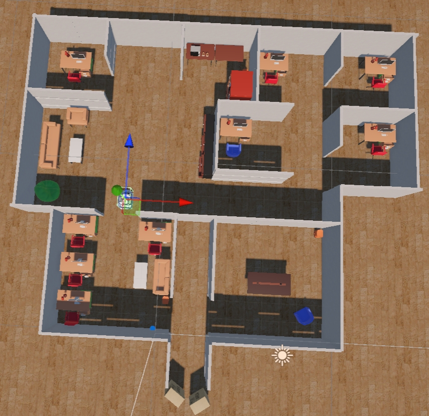
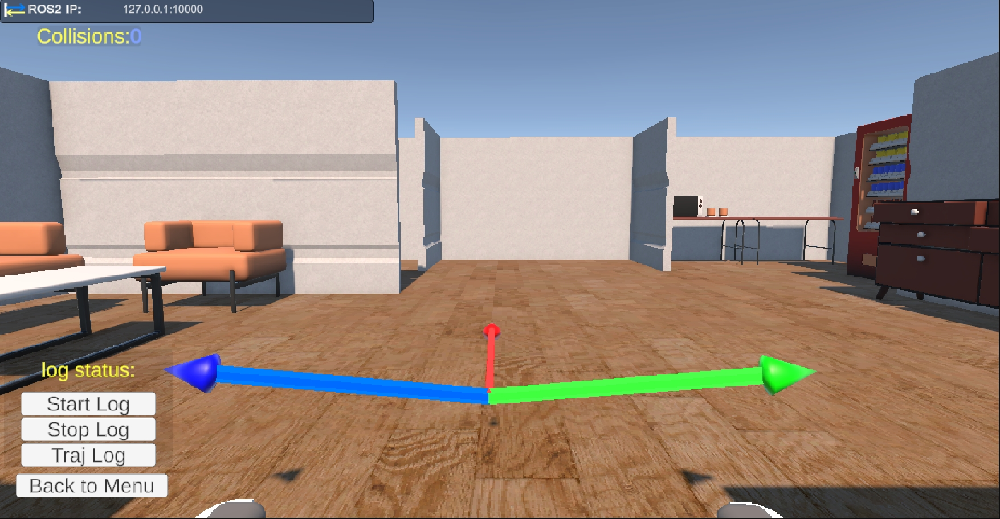

# BCI Wheelchair Simulator (Unity)

This is a Unity-based Brain-Computer Interface (BCI) wheelchair simulator designed to simulate intelligent wheelchair navigation and control in indoor environments. The simulator integrates with ROS2 systems and supports the development and testing of Shared Control algorithms.

<div align="center">

</div>

## Related Projects

**This project works with the following ROS2 project**
- [BCI_Wheelchair_Shared_Control](https://github.com/Lere8848/BCI_Wheelchair_Shared_Control) - BCI wheelchair shared control algorithm implementation

Both projects need to run simultaneously, with the Unity simulator serving as the hardware platform and the ROS2 project providing control algorithms.

## Environment Setup

### Unity Requirements
- **Unity Version**: Unity 6000.0.40f1 (Unity 6 LTS) or compatible

### Required Unity Packages
Please make sure you download the following packages through the **Package Manager**:

- `com.unity.robotics.ros-tcp-connector` - ROS-TCP communication bridge
- `com.unity.robotics.urdf-importer` - URDF robot model importer
- `com.unity.render-pipelines.universal` (17.0.4) - Universal Render Pipeline

### Installation Steps
1. **Install Unity Hub** and Unity 6000.0.40f1
2. **Clone this repository**:
   ```bash
   git clone https://github.com/Lere8848/BCI_Wheelchair_Simulator
   ```
3. **Open project in Unity**:
   - Launch Unity Hub
   - Click "Open" and select the project folder
4. **Install Unity Robotics Hub** (if not automatically installed):
   - Open Window > Package Manager
   - Click "+" and select "Add package from git URL"
   - Add: `https://github.com/Unity-Technologies/ROS-TCP-Connector.git?path=/com.unity.robotics.ros-tcp-connector`
   - A more detailed connection tutorial: [Unity-ROS Integration Setup Guide](https://github.com/Unity-Technologies/Unity-Robotics-Hub/blob/main/tutorials/ros_unity_integration/setup.md)

## System Components

### 1. Wheelchair Control System
- **`WheelchairControllerTest.cs`**: Subscribes to `/cmd_vel` topic from ROS2 to control wheelchair movement

### 2. Sensor System
- **Ultrasonic Sensor** (`UltrasonicPublisher.cs`): Publishes distance data to `/ultrasonic_*` topics
- **Camera Sensor** (`CameraPublisher.cs`): Publishes image data to `/camera/image_raw` topic
- **Collision Detection** (`CollisionPublisher.cs`): Publishes collision status to `/collision_flag` topic
- **IMU Sensor** (`IMUPublisher.cs`): Publishes attitude data
- **LiDAR** (`LidarPublisher.cs`): Publishes point cloud data
- **Odometry** (`OdomPublisher.cs`): Publishes position and velocity information

### 3. BCI Feedback System
- **`BCIFeedback.cs`**: Subscribes to `/bci_info` topic to display BCI intent confidence
- **`AttractorVisualizer.cs`**: Visualizes attractor directions (left, forward, right)
- Real-time display of control intention strength in three directions



### 4. Data Recording System
- **Trajectory Recording** (`WheelchairTrajLogger.cs`): Records complete wheelchair movement trajectory
- **State Recording** (`WheelchairStateLogger.cs`): Records position, pose, velocity and other state information
- **Collision Recording** (`CollisionLogger.cs`): Records collision count and positions
- **Input Recording** (`InputLogger.cs`): Records control command history
- **Obstacle Recording** (`ObstacleLogger.cs`): Records obstacles in the environment

### 5. Data Analysis Tools
- **`traj_plot.py`**: Python script for visualizing wheelchair trajectory and collision points. Generates trajectory plots including obstacles, movement paths and collision locations
